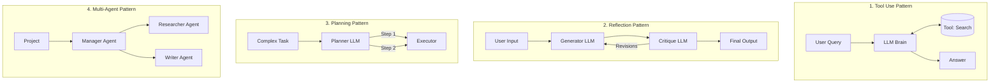

# Practical 5.0 — What are Agent Design Patterns? 🧩

## Why, in simple terms

When building software, developers use "Design Patterns" — proven, standard ways to solve common problems (like the Singleton or Observer patterns).

When building AI Agents, we also use design patterns! These are standard architectures for connecting the AI "Brain" to its "Tools". By learning these patterns, you can build reliable, powerful agents without reinventing the wheel.

---

## 🏛️ The 4 Core Agent Patterns

Here is a visual overview of the four most common ways to structure an AI Agent. 

### 1. Tool Use (Module 3)
The agent receives a query, decides what tool it needs, calls the tool, and returns the answer. (This is what you built in Module 3 with the Calculator tool!)

### 2. Reflection / Critique (Module 5 - We are here!)
The agent writes a draft, and a **second agent** (or persona) critiques the draft to find mistakes. The first agent then fixes the draft. This massively improves quality.

### 3. Planning / Plan-Execute (Module 4)
The agent breaks a large task down into a numbered checklist, then executes them one by one. (This is what you built in Module 4 with the Resume Builder workflow!)

### 4. Multi-Agent Systems (Module 10)
Instead of one "God Agent", you create a team of specialized agents (a Manager, a Researcher, a Writer) that talk to each other.

---

## 💡 Key Takeaways

- You don't have to invent agent architectures from scratch.
- Different tasks require different patterns.
- We have already built **Tool Use** and **Planning**. Today, we master **Reflection**.

## Success checklist

- [ ] I can name the 4 core agent design patterns.
- [ ] I can explain what pattern we used in Module 3 (Tool Use).
- [ ] I can explain what pattern we used in Module 4 (Planning/Workflows).
