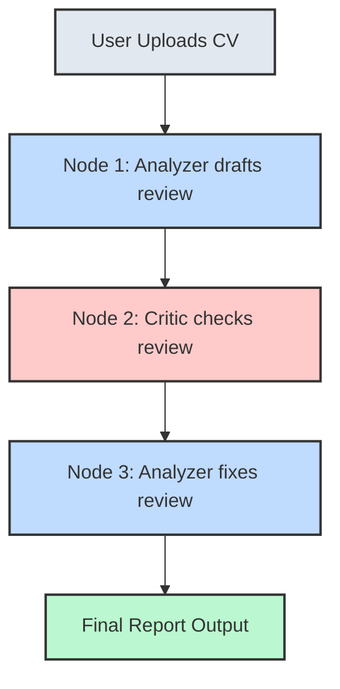

# Practical 5.1 — The Reflection Pattern 🪞

## Why, in simple terms

If you ask an LLM to write a 1,000-word essay, it often gets lazy halfway through. If you ask it to grade a complex document, it might miss obvious errors.

**Why?** Because generating text is hard. 

But *reading* and *critiquing* text is easy! The **Reflection Pattern** takes advantage of this. Instead of trusting the LLM's first draft, we pass that draft to a *second* prompt (a "Critic") whose only job is to find mistakes. Then we pass those mistakes back to the first prompt to fix them.

---

## 🛠️ The Job Analyzer Architecture

In this module, we are building the **Job Analyzer Agent** (Task 1 from the real-world projects). 
The user uploads a messy, badly formatted CV. The agent must grade it out of 100 and give feedback.

If we just asked an LLM to "Grade this CV", it might say: *"This CV is good but needs better formatting. Score: 85/100."* That's terrible feedback!

Instead, we use the Reflection Pattern in LangGraph:

### The Three Personas

1. **The Analyzer (Node 1):** Reads the CV and tries its best to write a review.
2. **The Harsh Critic (Node 2):** Reads the Analyzer's review. Its prompt says: *"You are a Senior HR Director. Check the review below. Did they include a score out of 100? Did they check for grammar? Find 3 things missing."*
3. **The Refiner (Node 3):** Takes the Critic's list of mistakes, and rewrites the original review to include them.

---

## 🎭 Dialogue: Why not just loop forever?

**Alex:** If we can critique and refine, why don't we loop 10 times to make it perfect?

**Jeevi:** You technically can! In a real Production system, you might have a router node that says: `if critique == "Perfect", END, else REFINE`. 

**Alex:** Why aren't we doing that?

**Jeevi:** Three reasons:
1. **Cost:** Every loop burns tokens.
2. **Latency:** Each LLM call takes ~2 seconds. A 10-loop cycle would make the user wait 20+ seconds for a response!
3. **Diminishing Returns:** Usually, just **one** critique cycle catches 90% of the mistakes.

For our API, a strict 1-cycle Reflection (Analyze -> Critique -> Refine -> End) guarantees a fast, high-quality response in about 6 seconds.

---

## 💡 Key Takeaways

- The Reflection Pattern uses a second LLM call to act as a "Critic".
- Generating perfect text in one shot is hard; critiquing text is much easier for an LLM.
- 1 cycle of reflection is usually the sweet spot for balancing cost, speed, and quality.

## Success checklist

- [ ] I understand how the Reflection pattern works.
- [ ] I can trace the Mermaid diagram from User Upload to Final Output.
- [ ] I understand the difference between the "Analyzer" persona and the "Critic" persona.
- [ ] I know why we use exactly 1 cycle instead of infinite loops.
